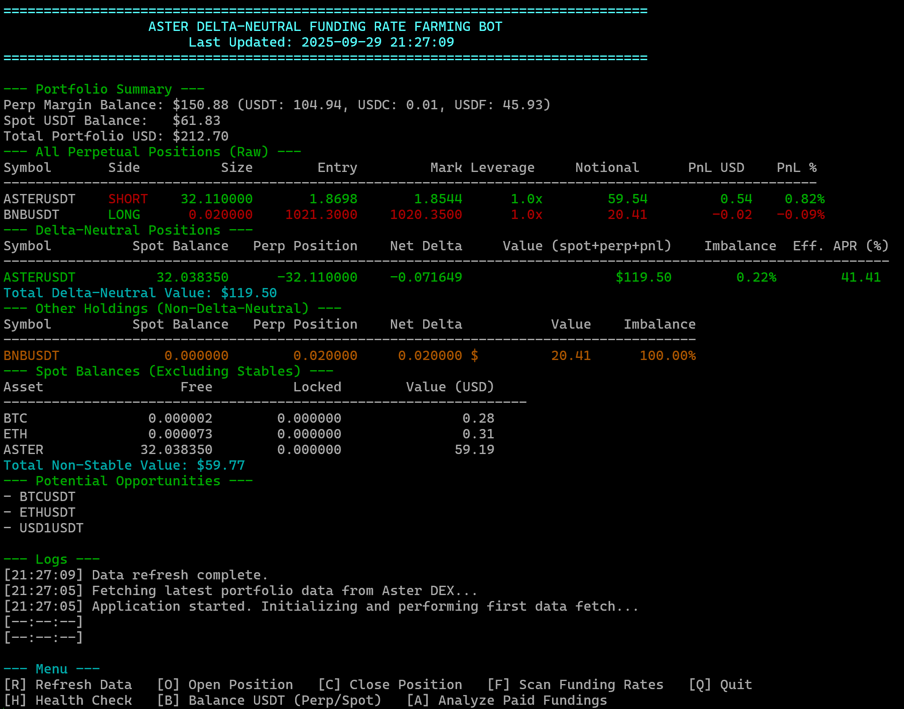

# ASTER DEX Delta-Neutral Funding Rate Farming Bot

This project is a terminal-based Python application for managing a delta-neutral funding rate farming strategy on the Aster DEX.

**Support this project**: Use referral link https://www.asterdex.com/en/referral/164f81 to get 10% rebate on trading fees (maximum rebate rate for you).

You don't need to run the bot continuously. You can use it to rebalance USDT between Perp and Spot, check the funding rates and opportunities, open and close delta neutral positions, and perform a health check and rebalance once in a while.

## Dashboard Preview



## Core Architecture

The application is built on a modular architecture with clear separation of concerns, ensuring maintainability, testability, and code reusability.

### Core Modules

#### 1. The Exchange Gateway: `aster_api_manager.py` (931 lines)

This module serves as the sole communication layer with the Aster DEX. It provides a high-level, unified API manager that abstracts the complexities of interacting with both the Perpetual and Spot markets.

**Key Responsibilities:**
- **Authentication:** Handles the unique Ethereum-based signature mechanism for the perpetuals API and the key/secret-based authentication for the spot API.
- **Data Fetching:** Provides methods to retrieve account balances, positions, order statuses, market data, and exchange trading rules.
- **Order Execution:** Offers simplified methods to place, manage, and cancel both spot and perpetual orders, automatically handling the required precision formatting for all order parameters.
- **Position Analysis:** Contains `perform_funding_analysis()` and `perform_health_check_analysis()` methods for comprehensive portfolio monitoring.

#### 2. The Brain: `strategy_logic.py` (518 lines)

This module contains the pure computational logic for the delta-neutral strategy. It is designed to be completely stateless and independent of the live API, which makes it highly testable and reliable. It takes market and account data as input and produces clear, actionable results.

**Key Responsibilities:**
- **Opportunity Analysis:** Identifies viable trading pairs and analyzes funding rate histories to find profitable opportunities.
- **Position Sizing:** Calculates the precise quantities for spot and perpetual legs required to establish a delta-neutral position, accounting for existing holdings and exchange-specific rules like minimum notional value.
- **Risk Management:** Contains logic to assess the health of existing positions by analyzing imbalance and other metrics.

#### 3. The UI & Orchestrator: `delta_neutral_bot.py` (1,004 lines)

This is the main application that brings the other modules together. It orchestrates the flow of data, presents a terminal-based dashboard to the user, and handles all user interaction.

**Key Responsibilities:**
- **Integration:** Initializes and manages the `AsterApiManager` and `DeltaNeutralLogic` components.
- **Orchestration:** Runs the main application loop, periodically fetching data, feeding it to the strategy logic, and updating the dashboard.
- **Interactive Workflows:** Manages user workflows for opening positions, closing positions, analyzing funding, and rebalancing accounts.
- **Dashboard Rendering:** Coordinates the display of portfolio information by delegating to specialized rendering functions.

### Supporting Modules

#### 4. UI Renderers: `ui_renderers.py` (319 lines)

A collection of pure rendering functions for terminal output, ensuring consistent formatting across all display modes.

**Contains:**
- `render_funding_rates_table()` - Displays funding rates with APR calculations
- `render_perpetual_positions_table()` - Shows perpetual positions with PnL analysis
- `render_portfolio_summary()` - Renders account balance summary
- `render_delta_neutral_positions()` - Displays delta-neutral position details
- `render_spot_balances()` - Shows spot asset balances
- `render_other_positions()` - Displays non-delta-neutral holdings
- `render_opportunities()` - Lists available trading opportunities
- `render_funding_analysis_results()` - Displays funding payment analysis

#### 5. CLI Commands: `cli_commands.py` (497 lines)

Standalone command-line interface functions for non-interactive operation and scripting.

**Contains:**
- `check_available_pairs()` - Lists available delta-neutral pairs
- `check_current_positions()` - Shows portfolio summary
- `check_spot_assets()` - Displays spot balances
- `check_perpetual_positions()` - Shows perpetual positions
- `check_funding_rates()` - Lists current funding rates
- `check_portfolio_health()` - Performs health check analysis
- `rebalance_usdt_cli()` - Rebalances USDT between accounts
- `open_position_cli()` - Opens a delta-neutral position
- `close_position_cli()` - Closes a delta-neutral position
- `analyze_fundings_cli()` - Analyzes funding payments

#### 6. Shared Utilities: `utils.py` (30 lines)

Common utility functions used across multiple modules.

**Contains:**
- `truncate()` - Precision-aware number truncation for exchange compliance

### Architecture Benefits

- **Modularity**: Each module has a single, well-defined responsibility
- **Reusability**: UI renderers and CLI commands can be imported and used anywhere
- **Testability**: Pure functions and clear boundaries enable comprehensive testing
- **Maintainability**: Changes in one area don't cascade to unrelated code
- **DRY Principle**: Zero code duplication across the entire codebase
- **Clean Imports**: Clear dependency graph prevents circular dependencies

## Running the Application

There are two ways to run the bot: locally using Python or with Docker for development.

### Method 1: Running Locally

#### 1. Install Dependencies

Ensure you have Python 3 installed. Then, install the required libraries using pip:

```bash
pip install -r requirements.txt
```

#### 2. Configure Environment Variables

You need to create both **API** and **Pro API** credentials on Aster Finance as shown below:


Create a `.env` file in the root directory of the project. This file will store your API credentials securely. Add your keys to the `.env` file as follows:

```
API_USER=0x...
API_SIGNER=0x...
API_PRIVATE_KEY=0x...
APIV1_PUBLIC_KEY=...
APIV1_PRIVATE_KEY=...
```

See also `.env.example.`


#### 3. Run the Bot

Once your dependencies are installed and your `.env` file is configured, you can start the application by running the main script:

```bash
# Run the interactive dashboard (default)
python delta_neutral_bot.py

# Or use CLI commands for specific tasks
python delta_neutral_bot.py --help
```

## CLI Commands

The bot includes a comprehensive command-line interface (CLI) for scripting and quick checks without launching the full interactive dashboard.

### General Commands

```bash
# Show all available options
python delta_neutral_bot.py --help

# Check available delta-neutral trading pairs
python delta_neutral_bot.py --pairs

# Show current funding rates with APR calculations
python delta_neutral_bot.py --funding-rates

# Show a comprehensive summary of all positions and balances
python delta_neutral_bot.py --positions

# Show only spot asset balances with USD values
python delta_neutral_bot.py --spot-assets

# Show only perpetual positions with detailed PnL analysis
python delta_neutral_bot.py --perpetual

# Perform a comprehensive health check on all delta-neutral positions
python delta_neutral_bot.py --health-check

# Rebalance USDT 50/50 between spot and perpetual accounts
python delta_neutral_bot.py --rebalance

# Analyze paid fundings for a specific delta-neutral position
python delta_neutral_bot.py --analyze-fundings [SYMBOL]
```

### Trading Commands

The `--open`, `--close`, and `--analyze-fundings` commands can be run in two modes:

1.  **Interactive Mode:** Run the command without arguments to launch a guided workflow.
2.  **Non-Interactive Mode:** Provide arguments directly on the command line. Use the `--yes` flag to bypass the final confirmation prompt, allowing for use in scripts.

```bash
# --- Open a Position ---

# Launch the interactive workflow to select a symbol and enter capital
python delta_neutral_bot.py --open

# Open a $120 position on BTCUSDT (will show a plan and ask for confirmation)
python delta_neutral_bot.py --open BTCUSDT 120

# Open a $120 position on BTCUSDT without a confirmation prompt
python delta_neutral_bot.py --open BTCUSDT 120 --yes


# --- Close a Position ---

# Launch the interactive workflow to select a position to close
python delta_neutral_bot.py --close

# Close the BTCUSDT position (will ask for confirmation)
python delta_neutral_bot.py --close BTCUSDT

# Close the BTCUSDT position without a confirmation prompt
python delta_neutral_bot.py --close BTCUSDT --yes


# --- Analyze Paid Fundings ---

# Launch the interactive workflow to select a position to analyze
python delta_neutral_bot.py --analyze-fundings

# Analyze the BTCUSDT position directly
python delta_neutral_bot.py --analyze-fundings BTCUSDT
```

### CLI Features

- **Concurrent API Calls**: Optimized performance with async/await patterns
- **Cross-Platform**: Works on Windows, Linux, and macOS
- **Colorized Output**: Enhanced readability with color-coded data
- **Error Handling**: Graceful handling of API timeouts and errors
- **Price Discovery**: Automatic USD value calculation across multiple quote currencies
- **Performance Metrics**: Real-time PnL calculations in both USD and percentage
- **Clean Session Management**: Proper cleanup and resource management

### Code Architecture Enhancements

- **Automated Precision Handling**: All order placement methods now automatically format price and quantity to meet exchange-specific precision requirements.
- **Fund Transfer API**: Integrated methods to transfer assets between spot and perpetual wallets.
- **Dynamic Pair Discovery**: The bot now dynamically discovers tradable pairs by checking for their existence in both spot and perpetual markets.
- **DRY Principle**: Eliminated code duplication with shared rendering and analysis functions.
- **Consistent Terminology**: Unified "perpetual" naming throughout the codebase.
- **Error Handling**: Improved API error suppression during price discovery.

### Method 2: Running with Docker (Recommended for Development)

#### 1. Prerequisites

Ensure you have Docker and Docker Compose installed on your system.

#### 2. Configure Environment Variables

Create the `.env` file as described in the local setup. The `docker-compose.yml` file is already configured to load this file. See `.env.example`.

#### 3. Build and Run the Docker Container

Open a terminal in the project's root directory and run:

```bash
docker-compose build
```

If you add new dependencies to `requirements.txt`, you will need to rebuild the image before running it again.

To start the bot:

```bash
docker-compose run --rm dn_bot
```

The `--rm` flag is added to automatically remove the container when the bot stops, which is good practice for one-off commands.
